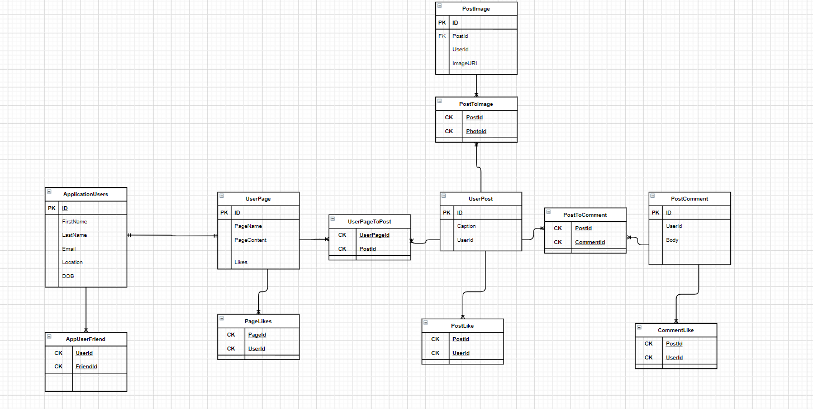

# Social Media For Modelers (Working Title)
- Author: Trevor Stubbs

---
## Web Application
- A web API that will serve a database and business logic to a view application. 

---

## Tools Used
Microsoft Visual Studio Community 2019

- C#
- Entity Framework
- MVC

## Data Model 
### Overall Project Schema 

### Routes
[API Routes](Routes.md)
> Key: `api/{controller}/{action}/{id?}`
- Account Routes - `/Account`
  - POST: `/Register`
    - Register a new user
  - POST: `/Login`
    - Login a user
  - POST: `/assign/role`
    - Allow a user with a higher role to change the role of a "lower" user.
- UserPage Routes - `/UserPage`
  - POST: `/`
    - Create a new page for the user
  - GET: `/`
    - Gets all the pages of the site
  - GET: `/{UserId}`
    - Gets the pages for that user
  - GET: `/{PageId}`
    - Gets a specific page
  - PUT: `/{PageId}`
    - Updates a user's page
  - DELETE: `/{PageId}`
    - Delete's a page 
      - TODO: Delete all the element from all the associated tables.
      - TODO: Front end needs to make doubly sure a user wants to do this.
  - POST: `/{PageId}/like/{userId}`
    - Add a like to a page
  - GET: `/{PageId}/like/{userId}`
    - Gets the total number of like for the page
  - DELETE: `/{PageId}/like/{userId}`
    - Delete a like from a page
- UserPost Routes - "/UserPost"
  - POST: `/`
    - Create a new post for the user
  - GET: `/`
    - Gets all of posts from the site (should be restricted to admins only)
  - GET: `/{UserId}`
    - Gets all of the posts from a specific user
  - GET: `/{PostId}`
    - Gets a specific post
  - PUT: `/{PostId}`
    - Updates a specific post
  - DELETE: `/{PostId}`
    - Deletes a post from the database
      - TODO: deletes comments, images, and likes.
  - POST: `/{PostId}/{userId}`
    - Add a like to a page
  - GET: `/{PostId}/{userId}`
    - Gets the total number of like for the page
  - DELETE: `/{PostId}/{userId}`
    - Delete a like from a page
  - POST: `/{PostId}/{ImageId}`
    - Adds an image to the post
  - DELETE: `/{PostId}/{ImageId}`
    - Deletes an image from the post
  - POST: `/{PostId}/{CommentId}`
    - Adds a comment to the post
  - DELETE: `/{PostId}/{CommentId}`
    - Deletes a comment from the post
- PostImage Routes - "/PostImage"
  - POST: `/`
    - Create a new image entry for the user
    - Adds the image to S3
  - GET: `/`
    - Gets all of images from the site (should be restricted to admins only)
  - GET: `/{UserId}`
    - Gets all of the images from a specific user
  - GET: `/{PostId}`
    - Gets the images associated with a specific post
  - GET: `/{ImageId}`
    - Gets a specific image
  - PUT: `/{ImageId}`
    - Updates a specific image
  - DELETE: `/{ImageId}`
    - Deletes a image from the database
    - And deletes the image from S3
- PostComment Routes - "/PostComments"
  - POST: `/`
    - Create a new comment for the user
  - GET: `/`
    - Gets all of comments from the site (should be restricted to admins only)
  - GET: `/{UserId}`
    - Gets all of the comments from a specific user
  - GET: `/{PostId}`
    - Gets all of the comments associated with a specific post
  - GET: `/{ImageId}`
    - Gets a specific comment
  - PUT: `/{ImageId}`
    - Updates a specific comment
  - DELETE: `/{ImageId}`
    - Deletes a comment from the database
  
### Model Properties and Requirements TODO
---
## Project Organization
- [GitHub Projects](https://github.com/TrevorStubbs/SocialMediaForModelers/projects)

### Scrum Log
- Sprint 1
  - Milestone 1
    - Initial Repo Build
    - ERD Scaffold
    - EF Core setup
- Sprint 2
  - Milestone 1
    - US1 PostCommentManager
    - US2 PostCommentManager Tests
  - Milestone 2
    - US1 PostImageManager
    - US2 PostImageManager Tests
  - Milestone 3
    - US 1 ApplicationUser
    - US 2 RoleInitializer
  - Milestone 4
    - US 1 UserPageManager
    - US 2 UserPageManager Tests
  - Milestone 5
    - US 1 UserPostManager
    - US 2 UserPostManager Tests
  - Milestone 6
    - US 1 AWS Setup
    - US 2 AWS S3 Manager
    - US 3 AWS S3 Integration
- Sprint 3
  - Milestone 1
    - US1 Route Plan
    - US2 Swagger Install
    - US3 JWT Token initialization
    - US4 Account Controller Built
