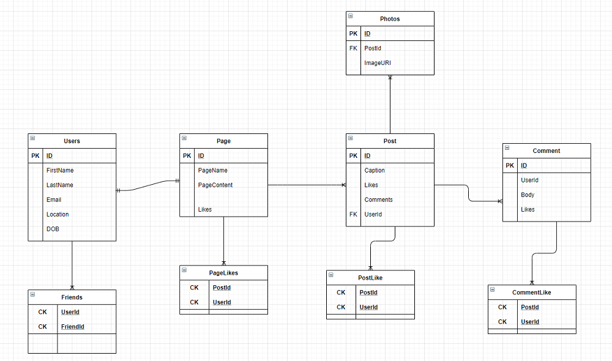

# Social Media For Modelers (Working Title)
- Author: Trevor Stubbs

---
## Web Application
- A web API that will serve a database and business logic to a view application. 

---

## Tools Used
Microsoft Visual Studio Community 2019

- C#
- Entity Framework
- MVC

## Data Model TODO
### Overall Project Schema TODO

### Model Properties and Requirements TODO
---
## Project Organization
- [GitHub Projects](https://github.com/TrevorStubbs/SocialMediaForModelers/projects)

### Scrum Log
- Sprint 2
  - Milestone 5
    - US 1 UserPostManager
  - Milestone 2
    - US2 PostImageManager Tests
    - US1 PostImageManager
  - Milestone 1
    - US2 PostCommentManager Tests
    - US1 PostCommentManager
- Sprint 1
  - Milestone 1
    - EF Core setup
    - ERD Scaffold
    - Initial Repo Build
